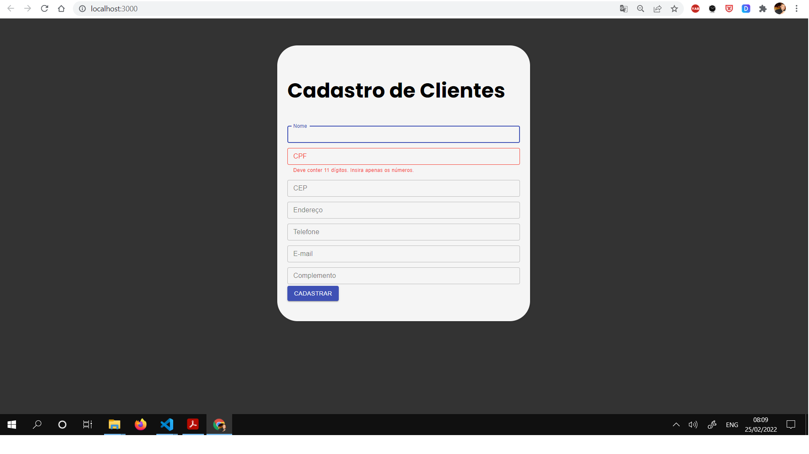

# Formulário de Cadastro com Validação de CPF utilizando React JS 
mellhorar tratamento do form (validar demais campos)

## Screenshot

<<<<<<< HEAD

1-npm install
2-npm run start
=======
 
 1-npm install
 2-npm run start
>>>>>>> 1f832863544e7ddac5e031c23c542e44351c716c
